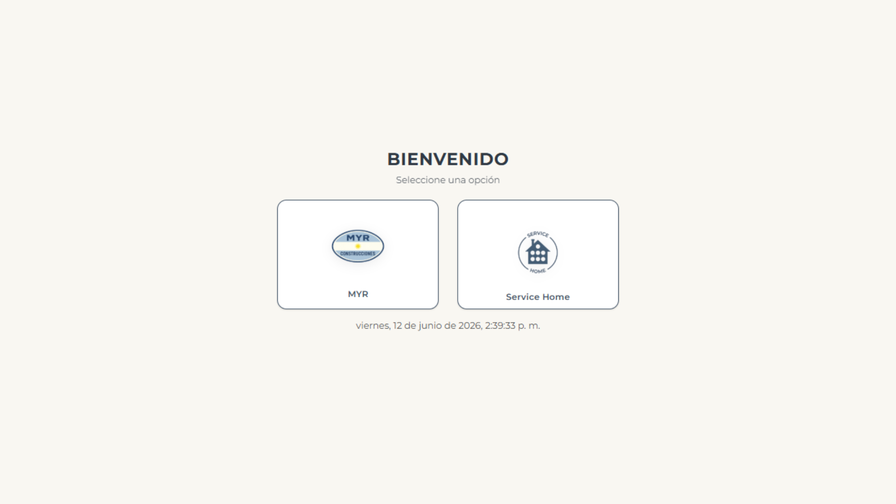
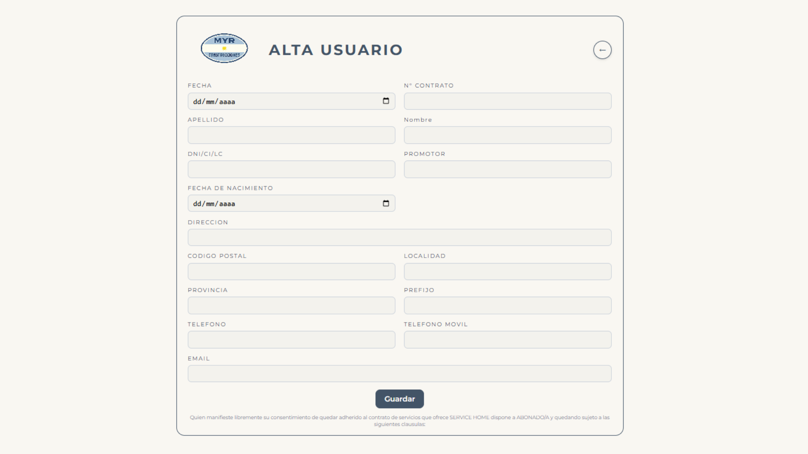
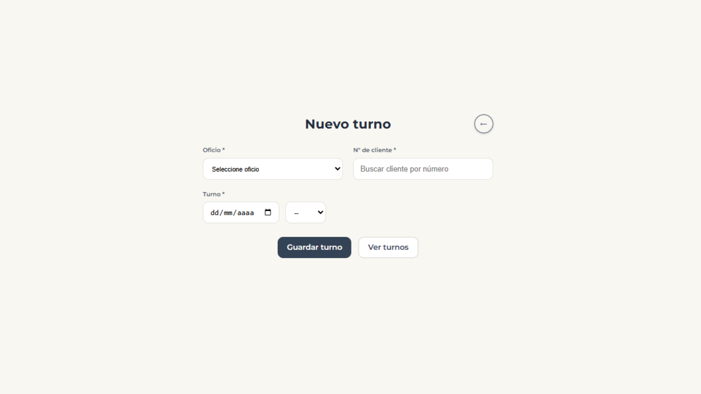
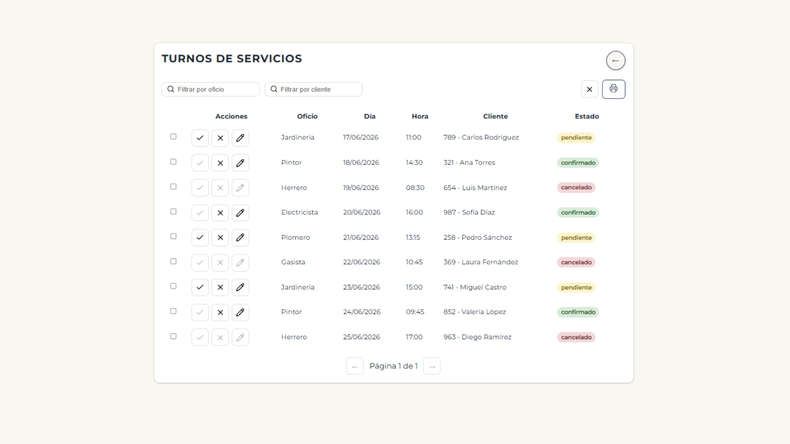

# BackOffice Administrativo

Aplicación Full Stack desarrollada para la gestión administrativa de clientes y turnos de servicio.

El sistema fue diseñado para centralizar operaciones internas mediante una interfaz administrativa que permite registrar clientes, gestionar turnos y consultar información de manera organizada.

---

# Capturas del proyecto

## Pantalla principal

## Alta de usuarios

## Creación de turnos

## Gestión de turnos

---

# Funcionalidades principales

- Gestión de usuarios
- Alta de clientes
- Registro de información personal
- Creación de turnos
- Administración de turnos
- Búsqueda y filtrado de registros
- Navegación entre módulos
- Validaciones de formularios
- Arquitectura frontend y backend desacoplada
- Desarrollo y consumo de APIs REST

---

# Tecnologías utilizadas

## Frontend

- React
- JavaScript
- Vite
- CSS Modules

## Backend

- Node.js
- Express

---

# Arquitectura

El proyecto fue desarrollado utilizando una arquitectura modular basada en separación de responsabilidades para facilitar el mantenimiento y la organización del código.

### Backend

- Routes
- Controllers
- Services
- Repositories
- Models
- Schemas
- Middlewares

### Frontend

- Components
- Features
- Services
- Router
- Context
- Custom Hooks

---

# Mi participación

Desarrollé el proyecto de forma integral participando en:

- Diseño de la interfaz de usuario
- Desarrollo del frontend en React
- Desarrollo de APIs REST
- Implementación de formularios y validaciones
- Gestión de usuarios y turnos
- Organización de la arquitectura del proyecto
- Integración entre frontend y backend
- Corrección de errores y mejoras funcionales

---

# Estado

Proyecto funcional desarrollado para un cliente particular.

El repositorio fue adaptado para portfolio eliminando configuraciones específicas y datos privados.
